<p align="center">
  
</p>

<h1 align="center">⚡ P!NG — Neo-Brutalist Dating Application</h1>

<p align="center">
  <strong>A high-performance, privacy-first mobile dating experience engineered with bold Neo-Brutalist aesthetics, real-time WebSocket messaging, PostGIS differential geospatial discovery, and production-grade PostgreSQL RPC architectures.</strong>
</p>

<p align="center">
  <a href="https://reactnative.dev/"></a>
  <a href="https://expo.dev/"></a>
  <a href="https://www.typescriptlang.org/"></a>
  <a href="https://supabase.com/"></a>
  <a href="https://jestjs.io/"></a>
  <a href="https://sentry.io/"></a>
</p>

---

## 🎯 Executive Overview

**P!NG** reimagines modern mobile dating by ditching generic, pastel-minimalist design in favor of an **ultra-tactile, Neo-Brutalist visual identity** paired with **bulletproof full-stack engineering**.

Built as a production-ready showcase application, **P!NG** addresses the structural pain points of dating software:
1. **Privacy-Preserving Architecture**: Coordinates and exact birthdates are never exposed to clients. PostGIS calculates spatial proximities server-side, returning coarse distance buckets (`~1 km` granularity).
2. **Zero Inconsistent State**: All profile edits and photo manipulations run inside atomic PostgreSQL RPC transactions (`atomic_profile_save`), eliminating partial-write anomalies.
3. **Low-Latency Realtime Stack**: Supabase Realtime WebSocket subscriptions power instant delivery notifications, live match alerts, and typing indicators.
4. **Physical Tactility**: Built around 3px ink strokes, mechanical `5px 5px 0px #111111` drop shadows, energetic color blocking, and curated micro-haptics.

---

## 📱 Visual Showcase & Product Walkthrough

### 1. Core Discovery & Dynamic Profile View
The Discovery engine pairs high-throughput card gestures with rich profile deep dives featuring interactive lifestyle tags, prompt badges, and captioned photo reels.

<table align="center">
  <tr>
    <td align="center" width="33%">
      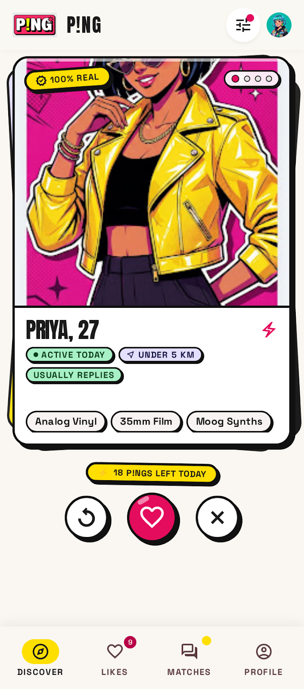
      <br /><strong>Discover Swipe Stack</strong>
      <br /><sub>Gesture-driven cards with instant Superping & Pass triggers</sub>
    </td>
    <td align="center" width="33%">
      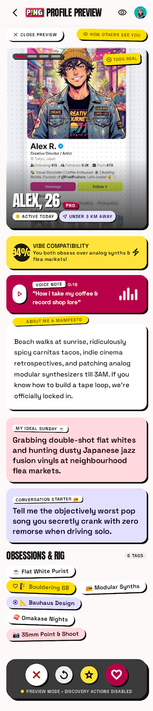
      <br /><strong>Detailed Profile View</strong>
      <br /><sub>Expandable lifestyle badges, bios, and verified indicators</sub>
    </td>
    <td align="center" width="33%">
      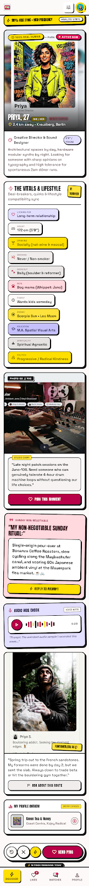
      <br /><strong>Captioned Photo Prompts</strong>
      <br /><sub>Structured icebreaker prompts attached directly to imagery</sub>
    </td>
  </tr>
</table>

---

### 2. Social Matchmaking & Real-Time 1-on-1 Chat
Instant notifications and dual-direction swipe matches unlock direct WebSocket conversation channels with delivery receipts and unread count badges.

<table align="center">
  <tr>
    <td align="center" width="33%">
      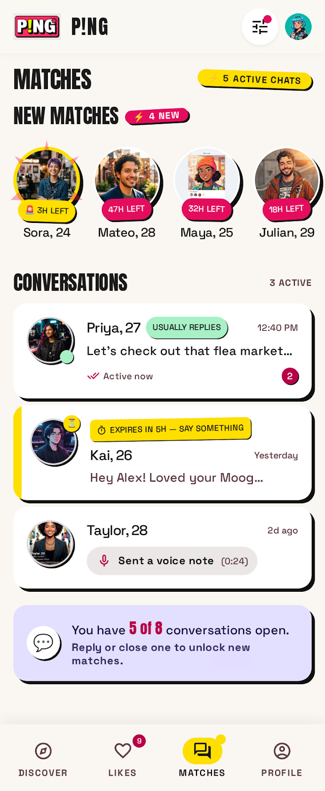
      <br /><strong>Likes Grid</strong>
      <br /><sub>Inbound like queue with real-time blur and status indicators</sub>
    </td>
    <td align="center" width="33%">
      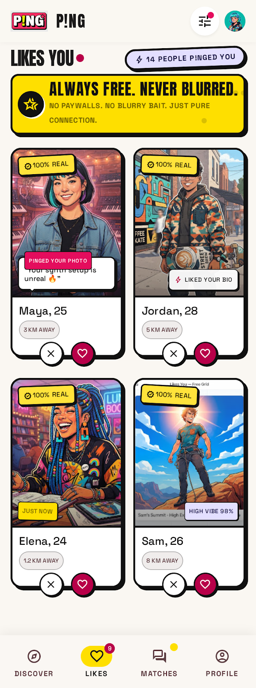
      <br /><strong>Matches & Conversations</strong>
      <br /><sub>Unified inbox with online status pips and timestamp sorting</sub>
    </td>
    <td align="center" width="33%">
      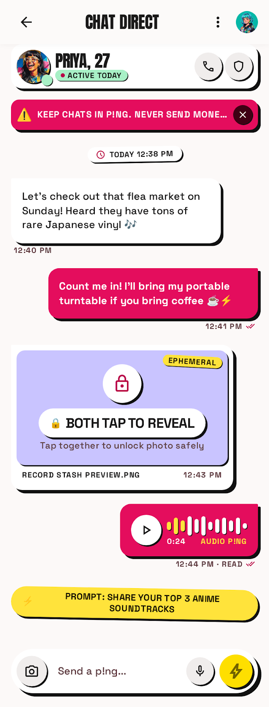
      <br /><strong>Real-Time Chat</strong>
      <br /><sub>Speech-bubble geometry with instant optimistic message rendering</sub>
    </td>
  </tr>
</table>

---

### 3. Progressive 7-Step Onboarding Funnel
Onboarding is structured as an interactive 7-step wizard that saves state progressively to `profiles.onboarding_step`. Users can drop off and resume without losing progress.

<table align="center">
  <tr>
    <td align="center" width="25%">
      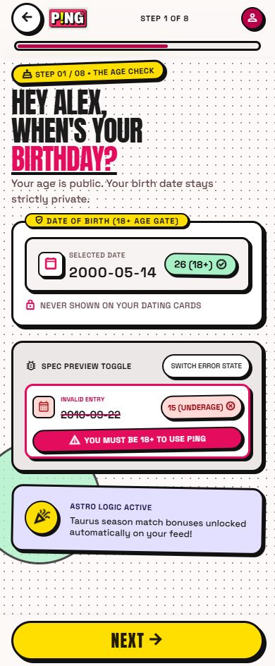
      <br /><strong>Step 1: Birthday</strong>
      <br /><sub>Age calculation & privacy gate</sub>
    </td>
    <td align="center" width="25%">
      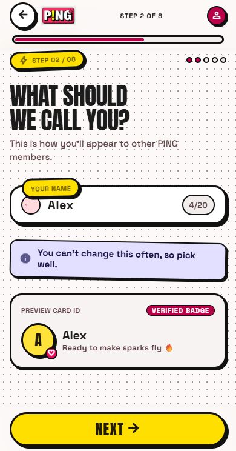
      <br /><strong>Step 2: Name</strong>
      <br /><sub>Display name & identity</sub>
    </td>
    <td align="center" width="25%">
      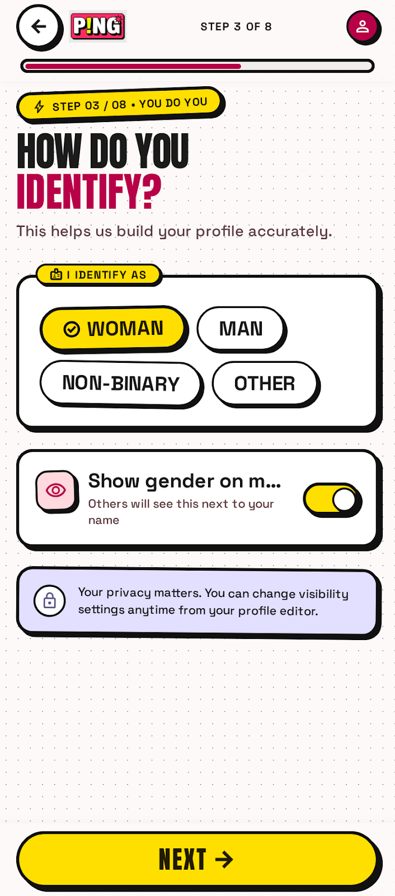
      <br /><strong>Step 3: Identity</strong>
      <br /><sub>Gender & expression select</sub>
    </td>
    <td align="center" width="25%">
      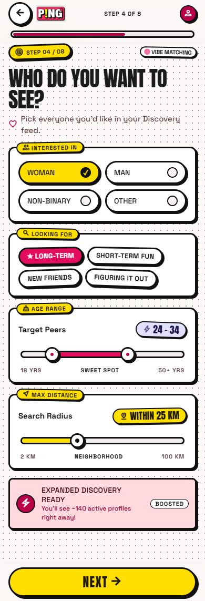
      <br /><strong>Step 4: Orientation</strong>
      <br /><sub>Dating interest preferences</sub>
    </td>
  </tr>
  <tr>
    <td align="center" width="25%">
      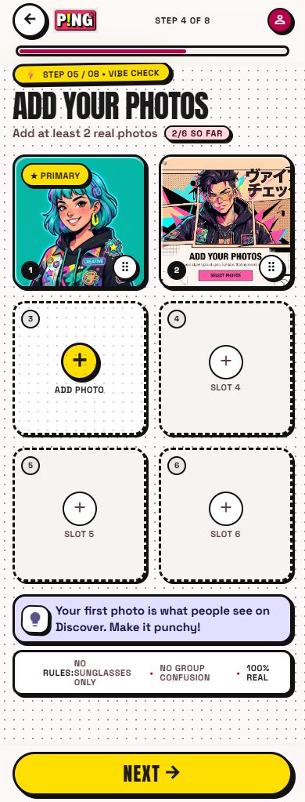
      <br /><strong>Step 5: Photos</strong>
      <br /><sub>Multi-slot upload & reorder</sub>
    </td>
    <td align="center" width="25%">
      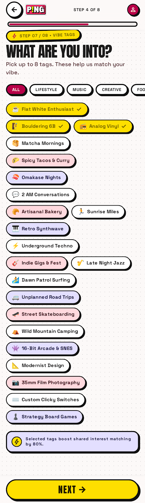
      <br /><strong>Step 6: Prompts</strong>
      <br /><sub>Personality prompts & bio</sub>
    </td>
    <td align="center" width="25%">
      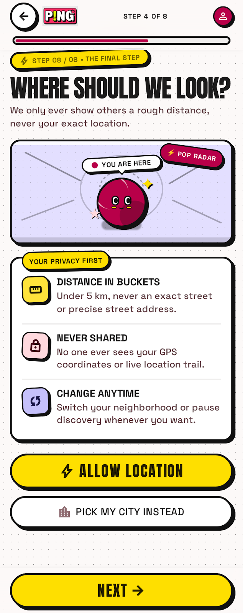
      <br /><strong>Step 7: Interest Tags</strong>
      <br /><sub>Categorized lifestyle pill tags</sub>
    </td>
    <td align="center" width="25%">
      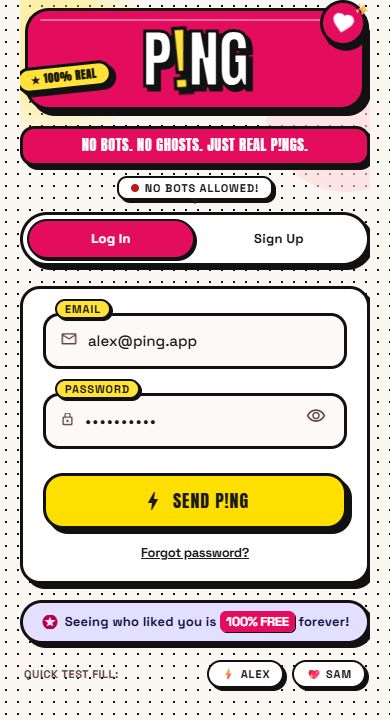
      <br /><strong>Authentication</strong>
      <br /><sub>Passwordless email link & OAuth</sub>
    </td>
  </tr>
</table>

---

### 4. Privacy, Account Security & Safety Centre
Safety is treated as a first-class feature rather than an afterthought, featuring app lock biometrics, dealbreaker filtering, and a full moderation reporting queue.

<table align="center">
  <tr>
    <td align="center" width="25%">
      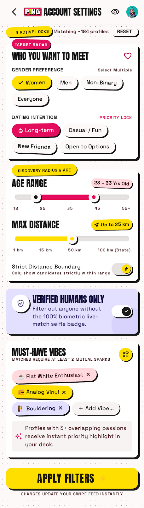
      <br /><strong>Dating Preferences</strong>
      <br /><sub>Distance, age & dealbreaker filters</sub>
    </td>
    <td align="center" width="25%">
      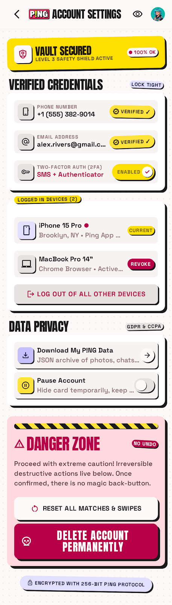
      <br /><strong>Security & App Lock</strong>
      <br /><sub>Biometric FaceID / Fingerprint lock</sub>
    </td>
    <td align="center" width="25%">
      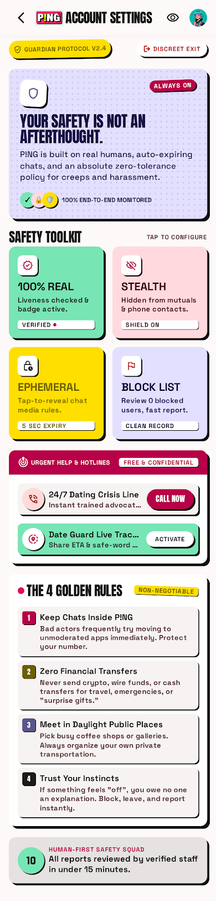
      <br /><strong>Safety Centre</strong>
      <br /><sub>Instant block, report & emergency safety</sub>
    </td>
    <td align="center" width="25%">
      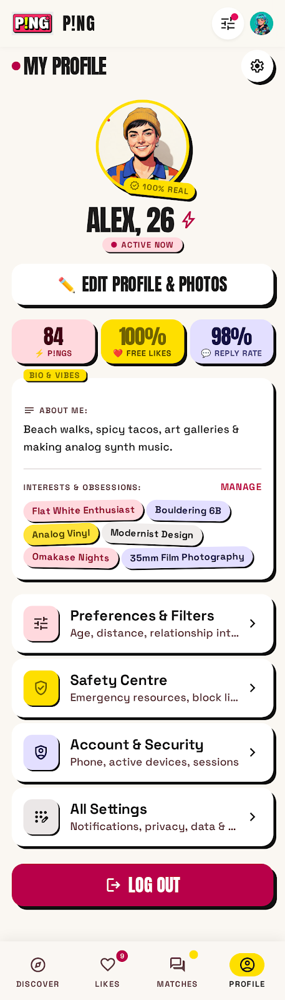
      <br /><strong>Profile Controls</strong>
      <br /><sub>Profile editing, tags & audit logs</sub>
    </td>
  </tr>
</table>

---

## 🏗️ System Architecture & Engineering Rigor

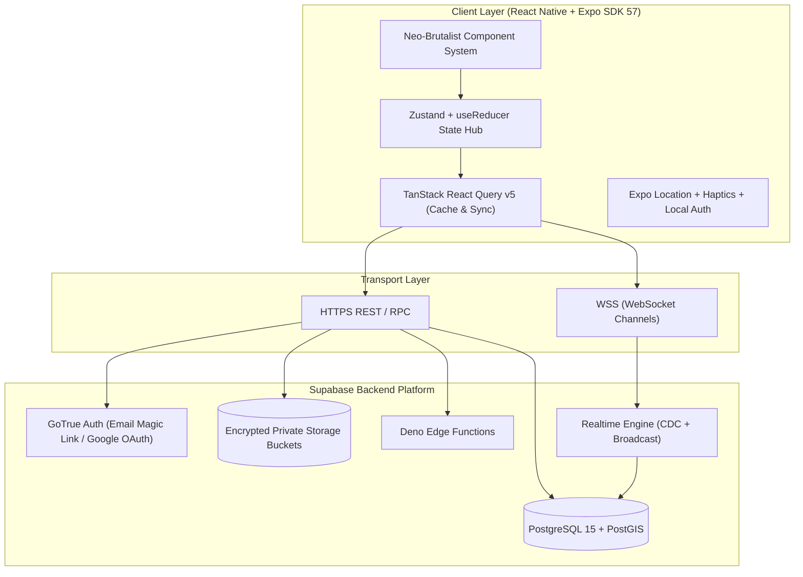

### 🔒 Differential Location Privacy Model
Traditional dating applications send raw GPS coordinates to mobile clients, exposing users to trilateration attacks. **P!NG** resolves this via a multi-tier spatial privacy pipeline:
1. **Centroid Snapping**: When the client syncs device location (`expo-location`), latitude and longitude are immediately fuzzed and rounded to a `~1 km` centroid prior to database persistence.
2. **Database-Internal PostGIS**: Proximities are evaluated inside PostgreSQL via `ST_DWithin` and `ST_Distance` using spatial indices (`GIST`).
3. **Distance Coarsening**: The discovery RPC calculates distance buckets (`< 5 km`, `5–10 km`, `20+ km`). Raw coordinates are never selected in client RPC responses.

### ⚡ Atomic Profile & State Reducer
Profile editing handles complex state transitions across personal bios, multiple photo slots, prompt captions, and lifestyle tags.
- **Client Side**: Managed via an immutable pure reducer (`profileReducer.ts`) with deep dirty-checking, preventing redundant network payloads.
- **Server Side**: Executed via `atomic_profile_save` PostgreSQL function. All updates to `profiles`, `photos`, and `profile_prompts` execute in a single ACID transaction block. If any upload fails, the entire transaction rolls back.

---

## 🛠️ Technology Stack

| Layer | Technology | Version | Purpose |
| :--- | :--- | :--- | :--- |
| **Framework** | [React Native](https://reactnative.dev/) | `0.86.3` | Native cross-platform mobile runtime |
| **Tooling & Build** | [Expo SDK](https://expo.dev/) | `57.0.24` | Modern native toolchain & EAS deployment |
| **Language** | [TypeScript](https://www.typescriptlang.org/) | `6.0.3` | Strict end-to-end type safety |
| **State & Cache** | [TanStack React Query](https://tanstack.com/query) | `5.103.1` | Asynchronous cache, optimistic updates & sync |
| **Database** | [PostgreSQL](https://www.postgresql.org/) + [PostGIS](https://postgis.net/) | `15+` | Spatial indexing, RLS security & stored procedures |
| **BaaS Platform** | [Supabase](https://supabase.com/) | `2.109.0` | Auth, private storage, and realtime pub/sub |
| **Typography** | Anton & Plus Jakarta Sans | Google Fonts | Custom Neo-Brutalist typography hierarchy |
| **Security & Auth** | Expo Local Authentication | `57.0.3` | Biometric FaceID/TouchID app lock gate |
| **Testing** | [Jest](https://jestjs.io/) + ts-jest | `30.5.2` | Unit testing for reducers & validation |
| **Monitoring** | [Sentry React Native](https://sentry.io/) | `7.11.0` | Real-time crash diagnostics & telemetry |

---

## 🧪 Testing & Code Quality

The codebase enforces strict unit testing for state mutations and business rules:

```bash
# Run unit tests
npm test

# Run strict TypeScript validation
npm run typecheck
```

### Test Suite Summary:
```
PASS src/components/profile-editor/__tests__/profileReducer.test.ts
PASS src/services/__tests__/profile-validation.test.ts

Test Suites: 2 passed, 2 total
Tests:       16 passed, 16 total
Snapshots:   0 total
Time:        6.172 s
```

---

## 🚀 Getting Started Locally

### 1. Clone & Install Dependencies
```bash
git clone https://github.com/iamutkarshyadav/P-NG.git
cd P-NG
npm install
```

### 2. Configure Environment Variables
Copy `.env.example` to `.env.local` and add your Supabase credentials:
```bash
cp .env.example .env.local
```

```ini
EXPO_PUBLIC_SUPABASE_URL=https://your-project-ref.supabase.co
EXPO_PUBLIC_SUPABASE_ANON_KEY=your-supabase-anon-key
EXPO_PUBLIC_SENTRY_DSN=your-optional-sentry-dsn
```

### 3. Launch Development Server
```bash
# Start Expo development server
npx expo start

# Run on Web directly
npx expo start --web

# Run on Android / iOS (requires development build for notifications/biometrics)
npx expo start --android
npx expo start --ios
```

---

## 📂 Project Structure

```
P!NG/
├── assets/                    # Static brand assets and app icons
├── ref/                       # High-resolution screenshots and UI mockups
├── src/
│   ├── components/            # Reusable UI components
│   │   ├── profile-editor/    # Atomic Profile editor + profileReducer + tests
│   │   ├── profile-view/      # Dynamic profile showcase & prompt cards
│   │   └── AppLockGate.tsx    # Biometric security gate
│   ├── hooks/                 # Custom React Query & sensor hooks
│   ├── lib/                   # Supabase client, environment validation
│   ├── providers/             # SessionProvider & Global Contexts
│   ├── screens/               # Core application screens
│   │   ├── inapp/             # Chat, Likes, Matches, Profile, Preferences
│   │   └── onboarding/        # 7-Step progressive onboarding screens
│   ├── services/              # Domain services (auth, chat, discover, safety)
│   ├── theme/                 # Neo-Brutalist color tokens, shadows & fonts
│   └── types/                 # Auto-generated Supabase database types
└── supabase/
    ├── functions/             # Deno Edge Functions (delete-account, push)
    └── migrations/            # Version-controlled PostgreSQL migrations
```

---

## 🛡️ Security & Privacy Engineering

- **Row Level Security (RLS)**: Every database table (`profiles`, `photos`, `swipes`, `messages`) is locked down with strict RLS policies. Profiles cannot be scraped via REST endpoints.
- **Signed Photo URLs**: User photos are stored in private Supabase Storage buckets. Clients receive temporary signed URLs with strict TTL expiry.
- **Security Definer RPCs**: Matchmaking and swipe resolution execute inside audited stored procedures with role-based checks, preventing client tampering with match states.

---

## 👨‍💻 Author

**Utkarsh Yadav**  
- **GitHub**: [@iamutkarshyadav](https://github.com/iamutkarshyadav)  
- **Email**: [iamutkarshyadav1@gmail.com](mailto:iamutkarshyadav1@gmail.com)  

---

<p align="center">
  <sub>Built with passion, precision, and Neo-Brutalist discipline. ⭐ Star this repo if you find it inspiring!</sub>
</p>
